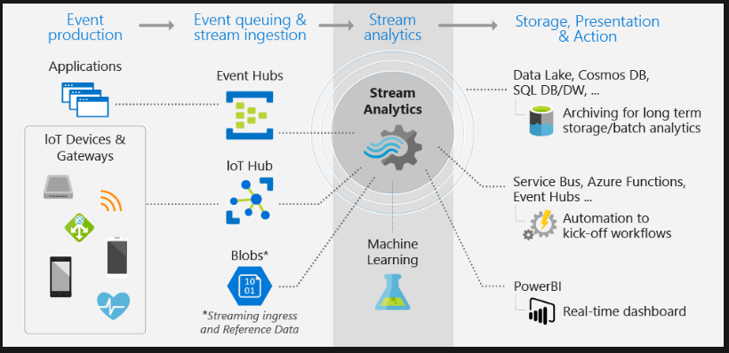

# Introduction

Data engineers must maintain data systems that are accurate, highly secure, and constantly available.

## On-Premises and cloud-based servers

CLoud Servers
an organization provisions service in the cloud and pays only for what it uses. Moving servers and services to the cloud also reduces operational costs.

### Computing environment

- require equipment to execute applications and services.
- overhead costs such as (power, cooling, periodic maintenance and storage)

### Licensing

- Each OS have it's licensing cost.

### Maintenance

- On-premises require maintenance for hardware, firmware, BIOS, OS, software and antivirus software.
- In the cloud, Microsoft manages many operations to create a stable computing environment.
- Microsoft manages key infrastructure services such as physical hardware, computer networking, firewalls and network security, datacenter fault tolerance, compliance, and physical security of the buildings. Microsoft also invests heavily to battle cybersecurity threats, and it updates operating systems and firmware for the customer

### Scalability

- scale an on-premises server horizontally, server administrators add another server node to a cluster. Clustering uses either a hardware load balancer or a software load balancer to distribute incoming network requests to a node of the cluster.
- scalability in the cloud is measured in compute units. Compute units might be defined differently for each Azure product

### Availability

- Service-level agreements (SLAs) specify your organization's availability expectations.
- Azure duplicates customer content for redundancy and high availability. Many services and platforms use SLAs to ensure that customers know the capabilities of the platform they're using.

|UP Time | Uptime hours per year | Downtime hours per year |
|:---: |:---:| :---:|
|99.9%| 8751.24 | 8.76|
|99.99%| 8759.12 | 0.88|
|99.999%| 8759.91 | 0.09|

### Support

- Cloud systems are easy to support because the environments are standardized
- On-premises due multiple vendors available, a company can use multiple vendors with different product. Which require a more support

### Multilingual support

- Cloud systems often store data as a JSON file that includes the language code identifier (LCID).The LCID identifies the language that the data uses. Apps that process the data can use translation services such as the Bing Translator API to convert the data into an expected language when the data is consumed or as part of a process to prepare the data

### Total cost of ownership

- describes the final cost of owing a given technology.
For On-Premises systems
- Hardware
- Software Licensing
- Labor (  installation, upgrades, maintenance )
- Datacenter overhead (power, telecommunications, building, heating and cooling)

Because on-premises server systems are very expensive, costs are often capitalized

- Azure track costs by subscriptions. A subscription can be based on usage that's measured in compute units, hours, or transactions.
- The cost of operating an on-premises server system rarely aligns with the actual usage of the system. In cloud systems, the cost usually aligns more closely with the actual usage.

### LIFT and SHIFT

When moving to the cloud, many customers migrate from physical or virtualized on-premises servers to Azure Virtual Machines. This strategy is known as lift and shift.
benefits include higher availability, lower operational costs, and the ability to transfer workloads from one datacenter to another. The disadvantage is that the application can't take advantage of the many features available within Azure.

## Understand Job responsibilities

a data engineer you'll extract raw data from a structured or unstructured data pool and migrate it to a staging data repository.Because the data source might have a different structure than the target destination, you'll transform the data from the source schema to the destination schema. This process is called transformation. You'll then load the transformed data into the data warehouse. Together, these steps form a process called extract, transform, and load (ETL).

## use cases for the cloud

### WEB

use the Azure Cosmos DB multimaster replication model to create a data architecture that supports web and mobile applications.
By reducing the processing time of their websites, global organizations can increase customer satisfaction.

### Healthcare

use Azure Databricks to accelerate big-data analytics and AI solutions. Apply these technologies to genome studies or pharmacy sales forecasting at a petabyte scale. Using Databricks features, you can set up your Spark environment in minutes and autoscale quickly and easily.

### IoT solutions

Using technologies like Azure IoT Hub, you can design a data solution architecture that captures information from IoT devices so that the information can be analyzed.

## Explore data Types

### Structured data

- Data structure is designed in the form of tables and is designed before any information is loaded into the system.
- Relational systems react slowly to changes in data requirements because the structural database needs to change every time a data requirement changes.

### non structural Data

- Non structured data is stored in nonrelational systems, commonly called unstructured or NoSQL systems.
- The data structure is defined only when the data is read.
- The open-source world offers four types of NoSQL databases:
  - key-value store
    - stored key-value of data in table structure
  - Document DB
    - Stored documents that are tagged with metadata to aid document searches.
  - graph DB
    - finds relationship between data points by using a structure that's composed of vertices and edges
  - Column DB
    - Stores data based on columns rather than rows.
    - columns can be defined at the query's runtime, allowing for flexible and performance data.

## Understand data storage in Azure

Azure storage offers four configuration options

- Azure Blob
  - A scalable object store for text and binary data
  - a data store that stores data but doesn't query it.
  - works well with images and unstructured data
- Azure Files
  - Managed file shares for cloud or on-premises deployments
- Azure Queue
  - A messaging store for reliable messaging between applications components
- Azure table
  - A NoSQL store for no-schema storage of structured data.
***key feature***
- Azure Storage accounts are scalable and secure, durable, and highly available. Azure handles your hardware maintenance, updates, and critical issues
***Data Ingestion***
- To ingest data into your system, use Azure Data Factory, Storage Explorer, the AzCopy tool, PowerShell, or Visual Studio.
***Data security***
- Azure Storage encrypts all data that's written to it. Azure Storage also provides you with fine-grained control over who has access to your data. You secure the data by using keys or shared access signatures.
- Azure Resource Manager provides a permissions model that uses role-based access control (RBAC). Use this functionality to set permissions and assign roles to users, groups, or applications.

## Azure data storage In Azure Data lake storage

Azure Data Lake Storage is a Hadoop-compatible data repository that can store any size or type of data. This storage service is available as Generation 1 (Gen1) or Generation 2 (Gen2).
Data Lake Storage Gen2 users take advantage of Azure Blob storage, a hierarchical file system, and performance tuning that helps them process big-data analytics solutions

***USES***

- store massive amounts of data for big-data analytics.

***Key features***

- Unlimited scalability
- Hadoop compatibility
- Security support for both access control lists (ACLs)
- POSIX compliance
- An optimized Azure Blob File System (ABFS) driver that's designed for big-data analytics
- Zone-redundant storage
- Geo-redundant storage

***data ingestion***

- ingest data into your system, use Azure Data Factory, Apache Sqoop, Azure Storage Explorer, the AzCopy tool, PowerShell, or Visual Studio.

***Queries***

- In Data Lake Storage Gen1, data engineers query data by using the U-SQL language. In Gen 2, use the Azure Blob Storage API or the Azure Data Lake System (ADLS) API.

***security***

- Data Lake Storage supports Microsoft Entra ACLs, security administrators can control data access by using the familiar Active Directory Security Groups. Role-based access control (RBAC) is available both in Gen1 and Gen2. Built-in security groups include ReadOnlyUsers, WriteAccessUsers, and FullAccessUsers.
- enable firewall to limit traffic to only azure services.

## Cosmos DB

- is a globally distributed, multi-model database:
  - SQL API
  - Mongo DB
  - Cassandra API
  - Gremlin API
  - Table API

***Uses***

Deploy Azure Cosmos DB when you need a NoSQL database of the supported API model, at planet scale, and with low latency performance. Currently, Azure Cosmos DB supports five-nines uptime (99.999 percent). It can support response times below 10 ms when it's provisioned correctly.

***Key features***

- supports 99.999 percent uptime
- can invoke a regional failover by using programing or the Azure portal.
- Azure Cosmos DB is guaranteed to achieve a response time of less than 10 ms for reads and writes by using multimaster replication.

***data ingestion***

- use Azure Data Factory, create an application that writes data into Azure Cosmos DB through its API, upload JSON documents, or directly edit the document.

***Queries***

- As a data engineer, you can create stored procedures, triggers, and user-defined functions (UDFs). Or use the JavaScript query API.

***Data security***

- Azure Cosmos DB supports data encryption, IP firewall configurations, and access from virtual networks. Data is encrypted automatically. User authentication is based on tokens, and Microsoft Entra ID provides role-based security

## SQL Database

- SQL Database is a managed relational database service
- It supports structures such as relational data and unstructured formats such as spatial and XML data

***uses***

- need to scale up and scale down OLTP systems on demand.
- can be more flexible than an on-premises SQL Server solution because you can provision and configure it in minutes.
- SQL Database is backed up with the Azure service-level agreement (SLA).

***features***

- delivers predictable performance for multiple resource types, service tiers, and compute sizes
- almost no administration, provides dynamic scalability with no downtime, has built-in intelligent optimization, global scalability and availability, and advanced security option

***ingesting and processing data***

- ingest data through Transact-SQL (T-SQL) techniques and from the movement of data using Azure Data Factory.\
- ngest data through application integration from a wide range of developer SDKs

***Queries***

- T-SQL to query the contents of a SQL Database.

***Data security***

- Advanced Threat Protection
- SQL Database auditing
- Data encryption
- Microsoft Entra authentication
- Multifactor authentication
- Compliance certification

## Azure Synapse Analytics

cloud-based data platform that brings together enterprise data warehousing and Big Data analytics

***key features***

- SQL Pools uses massively parallel processing (MPP) to quickly run queries across petabytes of data.
- the storage is separated from the compute nodes, you can scale the compute nodes independently to meet any demand at any time
- the Data Movement Service (DMS) coordinates and transports data between compute nodes as necessary
- Azure Synapse Analytics supports three types of distributed tables: hash, round-robin and replicated
- Azure Synapse Analytics can also pause and resume the compute layer.

***Ingesting and processing data***

- uses the extract, load, and transform (ELT) approach for bulk data.
- PolyBase is a technology that removes complexity for data engineers
- use Azure Data Factory to ingest and process data using PolyBase too.

***Queries***

- you can use the familiar Transact-SQL to query the contents of Azure Synapse Analytics
- Load data fast by using PolyBase with other Transact-SQL constructs such as CREATE TABLE and SELECT.

***Data security***

- supports both SQL Server authentication and Microsoft Entra ID.
- a data perspective, Azure Synapse Analytics supports security at the level of both columns and rows.

## Azure Stream Analytics

continuous event data known as data streams. Streaming data is high volume and has a lighter payload than nonstreaming systems.

***use***

data is ingested from applications or IoT devices and gateways into an event hub or IoT hub. The event hub or IoT hub then streams the data into Stream Analytics for real-time analysis.
Batch systems process groups of data that are stored in an Azure Blob store, in a single job that runs at a predefined interval

***Data ingestion***

- inputs from first-class integration sources. These sources include Azure Event Hubs, Azure IoT Hub, and Azure Blob storage.
- Bidirectional communication capabilities mean that while you receive data from devices, you can also send commands and policies back to devices.
- Azure Event Hubs provides big-data streaming services. It's designed for high data throughput, allowing customers to send billions of requests per day. Event Hubs uses a partitioned consumer model to scale out your data stream. This service is integrated into the big-data and analytics services of Azure.

***Data processing***

- Inputs are provided by Event Hubs, IoT Hubs, or Azure Storage. Stream Analytics can route job output to many storage systems. These systems include Azure Blob, Azure SQL Database, Azure Data Lake Storage, and Azure Cosmos DB.

***Queries***

- use a declarative Stream Analytics query language. The language should let you use straightforward SQL constructs to write complex temporal queries and analytics.
- Stream Analytics query language is consistent with the SQL language

***Data security***

- Stream Analytics handles security at the transport layer between the device and Azure IoT Hub.
- Event Hubs uses a shared key to secure the data transfer

## Azure HDInsight

provides technologies to help you ingest, process, and analyze big data. It supports batch processing, data warehousing, IoT, and data science.

***Key features***

- Hadoop includes Apache Hive, HBase, Spark, and Kafka. Hadoop stores data in a file system (HDFS). Spark stores data in memory in certain cases. This difference in storage can make Spark about 100 times faster.
- HBase is a NoSQL database built on Hadoop. It's commonly used for search engines. HBase offers automatic failover.
- Kafka is an open-source platform that's used to compose data pipelines. It offers message queue functionality, which allows users to publish or subscribe to real-time data streams.

***Data processing***

use Hive to run ETL operations on the data you're ingesting. Or orchestrate Hive queries in Azure Data Factory.

use Java and Python to process big data. Mapper consumes and analyzes input data. It then emits tuples that Reducer can analyze. Reducer runs summary operations to create a smaller combined result set.
Spark processes streams by using Spark Streaming
Storm supports common programming languages like Java, C#, and Python.

***Queries***
Hadoop supports Pig and HiveQL languages. In Spark, data engineers use Spark SQL.

***data security***
Hadoop supports encryption, Secure Shell (SSH), shared access signatures, and Microsoft Entra security.

## Azure data services

***Databricks***

- a serverless platform that's optimized for Azure.
- provides one-click setup, streamlined workflows, and an interactive workspace for Spark-based applications.
- adds capabilities to Apache Spark, including fully managed Spark clusters and an interactive workspace. You can use REST APIs to program clusters.

***Data factory***

- Data Factory is a cloud-integration service. It orchestrates the movement of data between various data stores.
- Use Data Factory to create and schedule data-driven workflows (called pipelines) that can ingest data from data stores.
- Data Factory processes and transforms data by using compute services such as Azure HDInsight, Hadoop, Spark, and Azure Machine Learning
- use Data Factory to organize raw data into meaningful data stores and data lakes so your organization can make better business decisions.

***Azure Purview***

- unified data governance service that helps you manage and govern your on-premises, multicloud and software-as-a-service (SaaS) data.
- Easily create a holistic, up-to-date map of your data landscape with automated data discovery, sensitive data classification and end-to-end data lineage.

### Data Engineer

- provision and set up data platform technologies that are on-premises and in the cloud.
- manage and secure the flow of structured and unstructured data from multiple sources.
- must also get, ingest, transform, validate, and clean up data to meet business requirements. This process is called data wrangling.

### Data scientist

- perform advanced analytics to extract value from data.
- Descriptive analytics evaluate data through a process known as exploratory data analysis (EDA). Predictive analytics are used in machine learning to apply modeling techniques that can detect anomalies or patterns, which are an important part of forecast models.

### AI engineer

- work with Azure AI services such as Azure Cognitive Search and the Bot Framework. Azure AI services includes Vision, Text Analytics, and Language.

Data engineers primarily provision data stores. They make sure that massive amounts of data are securely and cost-effectively extracted, loaded, and transformed.

AI engineers add the intelligent capabilities of vision, voice, language, and knowledge to applications, by using the Azure AI services offerings that are available out of the box.

When a Azure AI services application reaches its capacity, AI engineers call on data scientists. Data scientists develop machine learning models and customize components for an AI engineer's application.

## Move data around

***Extract***

- Define the data source: Identify source details such as the resource group, subscription, and identity information such as a key or secret.
- Define the data: Identify the data to be extracted. Define data by using a database query, a set of files, or an Azure Blob storage name for blob storage.

***Transform***

- Data transformation operations can include splitting, combining, deriving, adding, removing, or pivoting columns. Map fields between the data source and the data destination. You might also need to aggregate or merge data.

***Load***

Azure destinations can accept data formatted as a JavaScript Object Notation (JSON), file, or blob. You might need to write code to interact with application APIs.
Azure Data Factory offers built-in support for Azure Functions. It has support for many programming languages, including Node.js, .NET, Python, and Java. Although Extensible Markup Language (XML) was common in the past, most systems have migrated to JSON because of its flexibility as a semistructured data type

Start the job: Test the ETL job in a development or test environment. Then migrate the job to a production environment to load the production system.

Monitor the job: ETL operations can involve many complex processes. Set up a proactive and reactive monitoring system to provide information when things go wrong. Set up logging according to the technology that uses it.

## Holistic data engineering

Design data projects in phases that reflect the ELT approach:

- Source: Identify the source systems to extract from.
- Ingest: Identify the technology and method to load the data.
- Prepare: Identify the technology and method to transform or prepare the data.

- Analyze: Identify the technology and method to analyze the data.
- Consume: Identify the technology and method to consume and present the data.