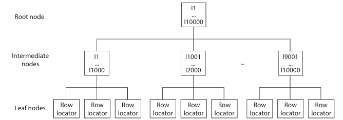

# introduction to Indices

If a table does not have an appropriate index, the database system uses the table scan method to retrieve rows
Table scan means that each row is retrieved and examined in sequence
(from first to last) and returned in the result set if the search condition in the WHERE clause
evaluates to TRUE.

Indices are stored in additional data structures called index pages.
For each indexed row there is an index entry, which is stored in an index page.

The Database Engine’s indices are constructed using the B+-tree data structure.

Index access is generally the preferred and obviously advantageous method for accessing tables with many rows. With index access, it takes only a few I/O operations to find any row of a table in a very short time, whereas sequential access (i.e., table scan) requires much more time to find a row physically stored at the end of the table


## Clustered Indices

A clustered index determines the physical order of the data in a table.
Database Engine allows the creation of a single clustered index per table, because the rows of the table cannot be physically ordered more than one way.

When using a clustered index, the system navigates down from the root of the B+-tree structure to the leaf nodes, which are linked together in a doubly linked list called a page chain.
its leaf contain data page

If a clustered index in defined for a table, the table is called a *clustered table*.


- clustered index is built by default for each table for which you define the primary key using the primary key constraint.
- each clustered index is unique by default
- If a clustered index is built on a nonunique column, the Database Engine will force uniqueness by adding a 4-byte identifier to the rows that have duplicate values.

## Nonclustered indices

- A nonclustered index does not change the physical order of the rows in the table.
- The leaf pages of a nonclustered index consist of an index key plus a bookmark.

- A bookmark of a nonclustered index shows where to find the row corresponding to the index key.

- If a clustered index exists, the bookmark of the nonclustered index shows the B+-tree structure of the table’s clustered index. If the table has no clustered index, the bookmark is identical to the row identifier (RID), which contains three parts: the address of the file to which the corresponding table belongs, the address of the physical block (page) in which the row is stored, and the offset, which is the position of the row inside the page.

- **Heap**
  - Traversal of the nonclustered index structure is followed by arrival of the rows the RID.

- **Clustered table**
  - Traversal of the nonclustered index structure id followed by traversal of the corresponding clustered index.



## Creating Indices

SYNTAX

```SQL
CREATE [UNIQUE] [CLUSTERED |NONCLUSTERED] INDEX index_name 
    ON table_name (column1 [ASC | DESC] ,...) 
           [ INCLUDE ( column_name [ ,... ] ) ] 
 [WITH 
[FILLFACTOR=n] 
[[, ] PAD_INDEX = {ON | OFF}] 
[[, ] DROP_EXISTING = {ON | OFF}] 
[[, ] SORT_IN_TEMPDB = {ON | OFF}] 
[[, ] IGNORE_DUP_KEY = {ON | OFF}] 
              [[, ] ALLOW_ROW_LOCKS = {ON | OFF}] 
              [[, ] ALLOW_PAGE_LOCKS = {ON | OFF}] 
[[, ] STATISTICS_NORECOMPUTE = {ON | OFF}] 
              [[, ] ONLINE = {ON | OFF}]] 
              [ON file_group | "default"]
```

- index_name identifies the name of the created index
- column1 is the name of the column for which the index is created
- The maximum size of an index is 900 bytes, while the index can contain up to 16 columns.
- The UNIQUE option specifies that each data value can appear only once in an indexed column.
- The CLUSTERED option specifies a clustered index. The NONCLUSTERED option (the default) specifies that the index does not change the order of the rows in the table.  The Database Engine allows a maximum of 249 nonclustered indices per table.
- Descending indices should be used when you create a composite
index on columns that have opposite sorting directions
- The INCLUDE option allows you to specify the nonkey columns, which are added to the leaf pages of the nonclustered index.
- Significant performance gains can be achieved when all columns in a query are included in the index, because the query optimizer can locate all the column values within the index pages without having to access pages with table data. This feature is called a covering index or covered query.
- FILLFACTOR=n defines the storage percentage for each index page at the time the index is
created.
- The PAD_INDEX option is tightly connected to the FILLFACTOR option. The FILLFACTOR option mainly specifies the percentage of space that is left free on leaf index pages. The PAD_INDEX option specifies that the FILLFACTOR setting should be applied to the index pages as well as to the data pages in the index.
- The DROP_EXISTING option allows you to enhance performance when re-creating a clustered index on a table that also has a nonclustered index.
- The SORT_IN_TEMPDB option is used to place into the tempdb system database the data from intermediate sort operations used while creating the index
- The IGNORE_DUP_KEY option causes the system to ignore the attempt to insert duplicate values in the indexed column(s).
- ALLOW_ROW_LOCKS option specifies that the system uses row locks when this option is activated (set to ON).
- ALLOW_PAGE_LOCKS option specifies that the system uses page locks when this option is set to ON
- The STATISTICS_NORECOMPUTE option specifies that statistics of the specified index  should not be automatically recomputed.

```SQL
CREATE INDEX i_empno ON employee (emp_no);

CREATE UNIQUE INDEX i_empno_prno 
    ON works_on (emp_no, project_no) 
    WITH FILLFACTOR=80;
```

### Editing Information Concerning Indices

- **sys.indexes**
  - catalog view contains a row for each index and a row for each table without a clustered index.
  - important columns of this view are object_id( name of DB object to which the index belongs), name, and index_id(name and the ID of that index).

- **sys.index_columns**
  - contains a row per column that is part of an index or a heap.
  - information can be used together with the information from sys.indexes to obtain further properties of specific index.

- **sp_helpindex**
  - system procedure displays all indices on a table as well as column statistics.
  - `sp_helpindex [@db_object=] 'name'`
- **OBJECTPROPERTY**
  - property function has two properties in relation to indices: IsIndexed and IsIndexable.
  - IsIndexed : whether a table or view has an index,
  - IsIndexable : whether a table or view can be indexed.

- **sys.dm_db_index_usage_stats**
  - dynamic management view (DMV) returns counts of different types of index operations and the time each type of operation was last performed.
  - Every individual seek, lookup, or update on the specified index by one query execution is counted as a use of that index and increments the corresponding counter in this DMV

### Editing Information Concerning Index Fragmentation

*fragmented* meaning the storage of data in ots pages is done inefficiently.

- **Internal**
  - occurs when there is empty space in the index pag, which can happen due to write operations.
- **external**
  - when logical order of the pages is wrong.

DVM **sys.dm_db_index_physical_stats** returns the size and fragmentation information for the data and indices of the specified table.  one row is returned for each level of the B+-tree.

```SQL
DECLARE @db_id INT; 
DECLARE @tab_id INT; 
DECLARE @ind_id INT; 
SET @db_id = DB_ID('sample'); 
SET @tab_id = OBJECT_ID('employee'); 
SELECT avg_fragmentation_in_percent, 
 FROM sys.dm_db_index_physical_stats 
(@db_id, @tab_id, NULL, NULL, NULL)

-- parameters 
/*
The first three specify the IDs of the current database, table, and index, respectively. 
The fourth specifies the partition ID , and the last one specifies the scan level that is used to obtain statistics
*/
```

- sys.dm_db_index_physical_stats view has several columns, of which avg_fragmentation_in_percent and avg_page_space_used_in_percent are the most important.

## altering Indices

- statement can be used for index maintenance activities
- ALTER INDEX statement supports three other activities additional from Create INDEX
  - Reorganizing leaf index pages using the REORGANIZE option
  - Disabling an index using the DISABLE option
  - Rebuilding an index using the REBUILD option

### Reorganizing Leaf Index Pages

- REORGANIZE option of the ALTER INDEX statement specifies that the leaf pages of the corresponding index structure will be reorganized so that the physical order of the pages matches the left-to-right logical order of the leaf nodes.
- this option removes some of the fragmentation from an index, thus improving performance.

### Disabling an Index

- DISABLE option of the ALTER INDEX statement disables an existing index.
- Each disabled index is unavailable for use until you enable it again. hence, indices must be completely rebuilt if you want to use them again.
- use the REBUILD option of the ALTER TABLE statement.

### Rebuilding an Index

- If the data is indexed, index fragmentation can
occur as well, and the information in the index can get scattered on different physical pages.
- Fragmented index data can cause the Database Engine to perform additional data reads, which decreases the overall performance of the system.
- two ways in which you can rebuild an index
  - Use the REBUILD option of ALTER INDEX statement.
  - Use of DROP_EXISTING option of CREATE INDEX statement

- If you specify ALL instead of an index name, all indices of the table will be rebuilt

### Creation of Resumable Online Indices

- SQL Server 2019 supports the creation of resumable online indices
- feature allows you to pause the build and then restart it later at the point it was paused.
- new option of the CREATE INDEX called RESUMABLE allows you to create a resumable online index.

```SQL
GO 
SELECT PersonID, StoreID, TerritoryID, AccountNumber, ModifiedDate
INTO sample.dbo.My_Customers
FROM AdventureWorks.Sales.Customer;

GO 
INSERT INTO My_Customers
SELECT SELECT PersonID, StoreID, TerritoryID, AccountNumber, ModifiedDate
FROM sample.dbo.My_Customers
GO 80
--  GO 80, executes the INSERT statement 80 times. 

GO 
  CREATE INDEX I_MyCustomers 
  ON My_Customers 
     (PersonID, StoreID, TerritoryID, AccountNumber,ModifiedDate) 
       WITH (RESUMABLE = ON, ONLINE = ON); 
USE sample; 
GO 
ALTER INDEX I_MyCustomers ON My_Customers 
 PAUSE; 
GO

--  a resumable index is only supported with online operations
```

- CREATE INDEX statement supports an additional clause called MAX_DURATION, specify the maximum time interval for building a resumable online index. Once the specified time is up, the index build automatically gets paused if it has not completed

- percentage of index creation using the sys.index_resumable_operations system view. This view monitors and checks the current execution status for a resumable online index.

```SQL
SELECT name, percent_complete, state 
    FROM sys.index_resumable_operations;
-- name column displays the name of resumaable index, 
-- percent_complete displays the percentage index creation has completed
-- state displays the operational state for resumable index (0 means running 1 mean paused)
```

### Removing and Renaming Indices

- DROP INDEX statement removes one or more existing indices from the current database.

> removing the clustered index of a table can be a very resource-intensive operation, because all nonclustered indices will have to be rebuilt

```SQL
DROP INDEX i_empno ON employee;

--  MOVE TO, which is analogous to the ON option of CREATE INDEX. 
-- you can specify a location to which move the data rows that are currently in leaf pages of the clustered index.
```

> DROP INDEX statement cannot be used to remove indices that are implicitly generated by the system for integrity constraints. You must drop the constraint.
> **SP_rename** can be used to rename indices

### Guidelines  for creating and Using Indices

- each index uses a certain amount of disk space, so it is possible that the total number of index pages could exceed the number of data pages within a database.
- in contrast to the benefits of using an index for retrievals, inserts and updates have a direct impact on the maintenance of the index

#### Indices and condition in WHERE Clause

- use of an index is especially recommended  if the selectivity of the condition is high
- selectivity of a condition is defined as the ratio of the number of rows satisfying the condition to the total number of rows in the table.
- The column should not be indexed if the selectivity of the condition is constantly 80 percent or more.  additional I/O operations will be needed for the existing index pages, which would eliminate any time savings gained by index access

```SQL
CREATE INDEX i_works ON works_on(emp_no, enter_date); 
SELECT emp_no, project_no, enter_date 
FROM works_on 
WHERE emp_no = 29346 AND enter_date='1.4.2016';
```

#### Indices and the Join Operator

- it is recommended that you index each join column
- you specify the PRIMARY KEY and FOREIGN KEY integrity constraints for the corresponding join columns, only a nonclustered index for the column with the foreign key should be created, because the system will implicitly create the clustered index for the PRIMARY KEY column.
