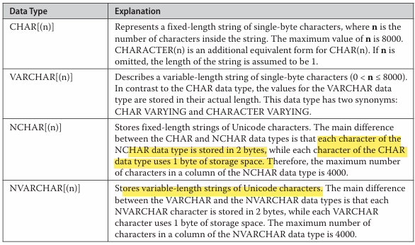

# SQL Basic Objects

## Literal Values

- an alphanumeric, hexadecimal, or numeric constant.
- A single quotation mark within a string delimited by single quotation marks, use two consecutive single quotation marks.
- Hexadecimal constants are used to represent nona-printable characters and other binary data.
- hex begins with '0x'

## identifiers

- used ot identify database objects such as database, tables and indices.
- represented by character strings that may include 128 characters and may contain letters, numerals or the following character _ , @, #, $
- the char # at the beginning of a table or stored procedure name denotes a temporary  objects.
- @ at the beginning of name denotes a variable.

## Delimiters

In T-SQL, Double quotation  have 2 meaning

- enclosing strings.
- can also be used as delimiters for so-called *delimited identifiers*.
- special kind of identifier usually used to allow the used reserver keywords as identifiers and also allow spaces in the name of database objects

## Comments

using the pair of characters  ```/* & */``` marks the enclosed test as comments
single line comments ```--``` ( used for ANSI SQL standard)

## Reserved keywords

T-SQL uses a variety such as CHARACTER, INTEGER.

## data types

T-SQL uses different data types, which can be categorized as

### Numeric Data types

represents numbers


### Character Data types

- can be strings of single-byte characters or strings of Unicode character.


### temporal data types

T-SQL supports the following temporal data types

- DATETIME
  - specify a date and time with value being stored as an integer value in 4 bytes.
  - range - 01/01/1900 to 12/31/9999
- SMALLDATETIME
  - same as DATETIME but store only 2 bytes.
  - range - 01/01/1900 to 06/06/2079
- DATE
  - stored in 3 bytes and has range 01/01/0001 to 12/31/9999
- TIME
  - stored in 3-5 bytes and has a accuracy of 100 nanoseconds.

- DATETIME2
  - stores high precision date and time data.
  - for variable lengths depending on the requirement
  - 6-8 bytes
  - accuracy of 100 ns.
  - not aware of DAYLIGHT saving.
- DATETIMEOFFSET
  - has a time zone offset portion
  - same as DATETIME2

the data value in T-SQL is by default specified as a string in format like 'mmm dd yyyy'. SET DATEFORMAT

## Miscellaneous Data Types

- Binary data types

  -

- BIT
- Large object data types
  - Large objects (LOBs) are data with maximum length of 2GB. these objects are generally used to store large text data to load modules and audio/video files.
  - VARCHAR, NVARCHAR, VARBINARY

- UNIQUEIDENTIFIER
  - unique identification number stored as a 16-byte binary string.
  - initialization of a column or a variable of the UNIQUEIDENTIFIER can be provided by NEWID and NEWSEQUENTIALID, a string constant written in a special forma using hexadecimal hyphens.
  - column of the UNIQUEIDENTIFIER data type can be referenced using the keyword ROWGUIDCOL in a query to specify that the column contains ID value
- SQL_VARIANT
  - used to store value of various data types at same time ( excluding TIMESTAMP)
  - It has two parts: data value and the information that describes teh value.
  - T-SQL supports SQL_VARIANT_PROPERTY function, which displays teh attached information for each value of SQL_VARIANT column.

- TABLE
- XML
- Spatial
- HIERARCHYID
  - store an entire hierarchy. it is implemented as Common lanaguage Runtime.
  - user-defined type that comprises several system functions for creating and operating on hierarchy nodes.
  - GetLevel(), GetAncestor(), GetDesendant(), Read().
- TIMESTAMP
  - column defined as VARBINARY(8) or BINARY(8), depneding on nullability of the column.
  - TIMESTAMP columns can be used to determine the relatove time at which rows were last changed.
  - ROWVERSION is synonym for TIMESTAMP
- User-Defined data types

## Storage Options

allows you to store LOBs and to save storage space:

- FILESTREAM
  - supports the storage for LOBs using VARBINARY(max) data type.
  - Binary Large Objects (BLOBs) are stored inside the database.
  - It can cause performance problems, it is common to store such files outside the database in external files.
  - option supports the management of LOBs, which are stored in NTFS file system.
  - Database Engine is able to manage FILESTREAM data even it is stored outside the database.
    - CREATE TABLE statement to store FILESTREAM data and use DML statement to query such data.
    - Database Engine assures the same level of security for FILESTREAM data as fr relational data stored inside the database.
- Sparse columns
  - used case is to help minimize data storage space.
  - columns provide an optimized way to store column values, which are predominantly NULL
  - you use sparse columns, NULL values require no disk space, but on the other side, non-NULL data needs an additional 2 to 4 bytes, depending on the data type of the non-NULL values
  - recommends using sparse columns only when the overall storage space savings will be at least 20 percent.
  - use the SPARSE option (after the column name) to specify that a particular column is a sparse column: ```col_name data_type SPARSE```

## Transact-SQL Functions

### Aggregate Funtions

- Applied to a group of data values from a column.
- always return a single value
types of Aggregate functions
- Convenient ( AVG, MAX and MIN, SUM, COUNT, COUNT_BIG)
- statistical
- User-defined
- Analytic

### Scalar Functions

- used in construction of scalar functions.
- A scalar function operates on a single value or list of values, whereas an aggregate function operates on the data from multiple rows.

TYPES of Scalar function s

- Numeric

- Date

- String

- System
provide extensive information about database objects.
most function uses a internal numeric indetifier(ID) which is assigned to the DB.

- Metadata
information about the specified database and DB objects.


### Scalar Operators

- used for operation with scalar values
- T-SQL supports numeric and Boolean operators


### Global variables

special system variables  that can be used as if they were scalar constants.

- have to be preceded by the prefix @@.


### NULL values
- special value that may be assigned to a column. 
- used where information in a column is unknown or not applicable.

