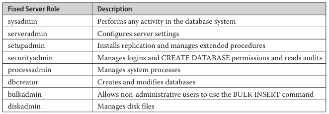
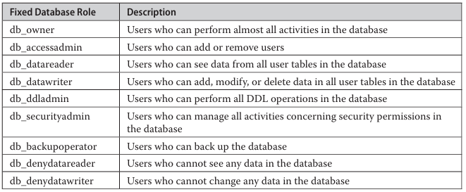
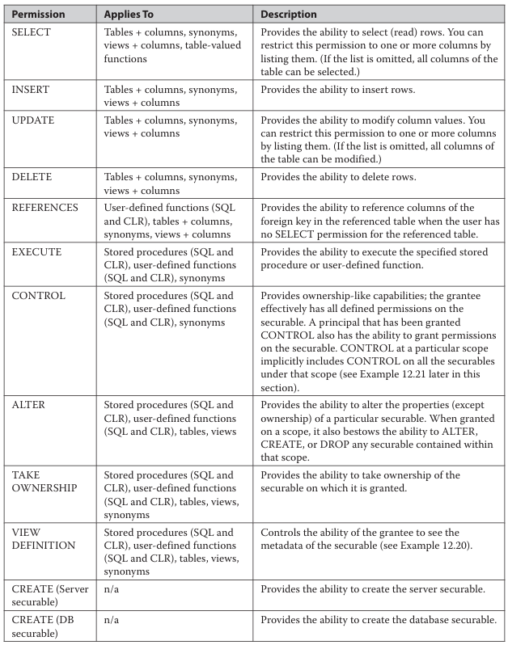

# Overview

The following begins with an overview of most important security concepts

- Data Encryption
- Authentication
- Authorization
- Schemas
- Roles
- Change Tracking
- Data Security and Views

***Some terms***

- **principal**
  - Subjects that have permission to access a particular entity.
  - A role is collection of logins and other roles.

- **Securable**

  - resources to which DB authorization system regulates access.
  - Most securable build a hierarchy.

- **Permissions**
  - securable has associated *permission* can be granted to a principal.
  
## Encrypting Data

The DB Engine secures data with hierarchical encryption layers and a key management infrastructure.
Each layer secures layer beneath it, using a combination of certificates,asymmetric keys, and symmetric keys.


**Service master key**
The service master key specifies the key that rules all other keys and certificates. the service master key is created automatically when you install the DB Engine.

- is encrypted using Windows Data  Protection API (DPAPI).
- managed by system

**DB master key**
root encryption object for all keys, certificates, and data at DB level.

- Each DB has single DB master key created by using `CREATE MASTER KEY`
- as this key is protected by service master key, it is possible for the system to automatically decrypt master key.

There are 3 types of user forms:

- ***Symmetric Keys***
  - sender and receiver shares a common key.
  - **Advantage**
    - can protect significant greater amount of data than any other type/
    - it is faster than using asymmetric key.
  - **disadvantage**
    - in distributed env, using this key can make it almost impossible to keep encryption secure.

- Each symmetric key must be opened before you can use it to encrypt data or protect another new key.

- After you open a symmetric key, you need to `EncryptByKey` system function for encryption. this function has two input parameters:
  - ID of the symmetric key to be used
  - text to be encrypted.
- for decryption, use `DecryptByKey`

- ***Asymmetric Keys***
  - consist og two parts: a private key and the corresponding public key.
  - Each key can decrypt data encrypted by the other key.
  - `EncryptByAsymKey` to encrypt data
  - `DecryptByAsymKey` to decrypt data.

- ***Certificates***
  - is a digitally signed statement that binds a value of public key to identity of the person, device or service that holds the corresponding private key.
  - Certificate are issued and signed by a certification authority (CA)
  > there is no significant difference between certificates and asymmetric keys. Both uses RSA algorithm
  - certificates contains more information
    - The subject's public key value
    - the subjects's identifier information
    - Issuer identifier information
    - The digital signature of the issuer.
- A primary benefit it relieve hosts of the need to maintain a set of passwords for individual subjects.

> Certificates provide highest level of encryption in DB engine security model. the encryption algorithm are very processor-intensive.

```SQL
USE master;
CREATE MASTER KEY
ENCRYPTION BY PASSWORD ='pls4w9dl' -- you password

GO 
CREATE CERTIFICATE cert01
    WITH SUBJECT = 'CERTIFICATE FOR DBO';

-- ENCRYPTION BY , you have to create DB master key 
-- if this option is not used CERTIFICATE is protected by DB master key 
-- 
```

## Editing Metadata Concerning User Keys

- sys.symmetric_keys
- sys.asymmetric_keys
- sys.certificates
- sys.database_principals
  - provides information about each of principals in the current information concerning existing certificates.
  
## Extensive Key management

- It is also known as EKM
  - Enhanced key security through a choice of encryption provider.
  - General key management across your enterprise
- EKM allows third party vendors to register their devices in the DB Engine.
- EKM also allows data protection form DB administrators (except members of the **sysadmin** group)
- Data can be encrypted and decrypted using T-SQL cryptographic Statements.
- DB Engine uses the external EKM as the key store.

## Methods of Data Encryption

### Transparent Data Encryption

- TDE option that encrypts the DB files automatically, without needing to alter any applications.
- prevent access by unauthorized persons even if they obtain DB files or Db backup files.
- performed at the page level
- based on a encryption key, symmetric key, which secures encrypted DB.

Steps

1. Create a DB master key
2. create a certificate
3. Create a Encryption key
4. Configure DB to use encryption

```SQL
-- associate the certificate to sample DB
CREATE DATABASE ENCRYPTION KEY 
WITH ALGORITHM = AES_128
ENCRYPTION BY SERVER CERTIFICATE cert_01;

-- Encrypt the DB 
ALTER DATABASE sample SET ENCRYPTION ON;

-- sys.dm_database_encryption_keys, which can be used to display all databases that are encrypted.
--
SELECT * FROM sys.dm_database_encryption_keys WHERE encryption_state =3;
```

### Always Encrypted

- encrypt particular columns of a Database.

> columns belonging to primary keys, and other non-sensitive columns should not be encrypted for performance reasons.

- Database driver handles the process of encrypting and decrypting of data.
- When query is executed it looks up the master key. the master key is then used to decrypt a column specific key. which in turn used for encrypting and decrypting fields and parameters.

STEPS

1. Create a column master key (CMK)
2. create a column encryption key (CEK)
3. Create a table with one or more encrypted columns.

- The column master key is used to protect column encryption key. the column master key definition object is created in DB. This object will store the information about the location of column master key.
- The easiest option for developing new application using Always Encryption is to use a certificate.

> can create a column master key using the `CREATE COLUMN MASTER KEY`statement.  create a column encryption key using the `CREATE COLUMN ENCRYPTION KEY` statement.

```SQL
CREATE TABLE employee_encr(
  emp_no INT NOT NULL,
  emp_lname nvarchar(11) COLLATE Latin1_General_BIN2 ENCRYPTED 
    WITH (ENCRYPTION_TYPE = DETERMINISTIC, ALGORITHM='AEAD_AES_256_CBC_HMAC_SHA_256',
    COLUMN_ENCRYPTION_KEY = MyCEK) NOT NULL,
    salary MONEY ENCRYPTED WITH (ENCRYPTION_TYPE=RANDOMIZED,
      ALGORITHM='AEAD_AES_256_CBC_HMAC_SHA_256', COLUMN_ENCRYPTION_KEY = MyCEK) NOT NULL
);
```

*Deterministic encryption* ensures a given value always has the same encrypted representation. can be used to seek values, join, equality comparisons, and grouping operations.

*randomized encryption* delivers a different value every time. it is more secure, because value cannot be guessed. the disadvantage is that you can not perform any operation on columns with randomized encryption.

***Always Encrypted has several general limitations***

- Alphanumeric columns are encrypted with deterministic encryption have to use the Latin1_General_BIN2 collation
- indices and constraints can be created only for columns with deterministic encryption.
- all range-like operations are disallowed.
- Client libraries need to be updated to support encryption and decryption of columns. Not all drivers will support this functionality
- The following data types are not supported : SQL_VARIANT, XML, GEOGRAPHY, GEOMETRY, and user-defined types (UDTs).

### transparent Data encryption vs Always Encrypted

- TDE is DB level. Always encrypted is column level encryption.
- With TDE, each data page is encrypted when written on disk and is decrypted when read from disk (Encrypted at rest). Always encrypted at rest and in memory, meaning data is encrypted on the disk, in memory as well. decryption is possible in user application.

#### Monitoring Always Encrypted

**sys.columns_encryption_keys** is the most important catalog  view in relation to Always encrypted. the view returns information about the column encryption keys.

```SQL
SELECT t.name as table_name, c.name as column_name, c.encryption_type_desc as encr, k.name FROM sys.columns c 
JOIN sys.column_encryption_keys k 
ON (c.column_encryption_key_id = k.column_encryption_key_id)
JOIN sys.tables t ON (c.object_id = t.object_id);
```

## Authentication

The Database engine's security include two different security subsystems:

- ***Windows Security***
  - specifies security at the operating system level
  - Authentication using this subsystem is also called Windows authentication.

- ***Database Engine Security***
  - specifies the additional security necessary at the system level.
  - SQL server login is created within the system and is associated with a password.
  - is called SQL server authentication

Two modes of operation in SQL server for Authentication

- ***Windows Mode***
  - users to use accounts exclusively to log in to system.
  - It is also known as *trusted connection* as the user is validated at the operating system.
- ***Mixed Mode***
  - connect the DB engine either using Windows authentication or SQL Server authentication
  - SQL server authentication is provided for backward compatibility only.

### Setting up the DB system Security

- ***SQL SERVER management studio***

- ***Managing Security using T-SQL Statement***
  - `CREATE LOGIN`, `ALTER LOGIN`, `DROP LOGIN`
  
```SQL
  CREATE LOGIN login_name 
    { WITH option_list1 
    FROM {WINDOWS [WITH option_list2 [, .....]]
    | CERTIFICATE certname | ASYMMETRIC KEY key_name}
    }

```

- login_name specifies the name of the login that is being created.
- option_list1 contains several options
  - PASSWORD option which specifies the password of the login
  - DEFAULT_DATABASE, DEFAULT_LANGUAGE,  CHECK_EXPIRATION
- FROM clause
  - WINDOWS specifies that login will be mapped to an existing user account.
  - CERTIFICATE specifies name of certificate to be associated with this login
  - ASYMMETRIC KEY specifies the asymmetric key to be associated with this login.

```SQL
CREATE LOGIN mary WITH PASSWORD='youknow4it9!';

CREATE LOGIN [NTB11901\pete] FROM WINDOWS;
```

#### The sa LOGIN

System administrator (sa) is special login provided for backward compatibility. By default, it is assigned to **ssyadmin** fixed server role and cannot be changed.

## Schemas

- to simplify the relationship between users and objects.

### user-Schema Separation

- a schema is collection of DB objects that is owned by a single person
- main purpose of schema is to group logically related objects of large database in different subunits.
- the DB engine supports named schemas using the notion of a *principal*
  - An indivisible principal represents a single user.
  - A group principal can be group of users.
  - principals are ownership of schemas, but ownership can be transferred easily to another principal and without changing the schema name.
- the separation of DB from schemas provides benefits
  - One principal can own several schemas.
  - Several indivisible can own a single schema via membership in roles or Windows group
  - Dropping a DB user does not require the renaming of objects contained by that user's schema.

Each DB has a default schema, which is  used to resolve the names of objects that are reffered to without their fully qualified names
The default schema specifies the first schema that will be searched by DB server when it resolves the names of objects.
if DEFAULT_SCHEMA is left undefined, the DB user will have **dbo** as its default schema.

#### DDL Schema-Related Statement

- ***CREATE SCHEMA***

  - `CREATE SCHEMA` can create schema, create table and views it contains; and grant deny or revoke permissions on a securable.
  Securable has 3 main scopes : server, database, schema.
  - `Create Schema` is atomic. if any error occurs during the execution of CREATE SCHEMA, none of T-SQL statements specified in the schema will be executed.
  - DB-level principal could be a user, role or application role.
  - Ownership of schema-contained objects can be transferred to any other database-level principal using the `ALTER AUTHORIZATION` statement.

  ```SQL
  CREATE SCHEMA my_schema AUTHORIZATION peter
  GO 
  CREATE TABLE product(
    product_no CHAR(10) NOT NULL UNIQUE,
    product_name CHAR(20) NULL,
    price MONEY NULL
  );
  GO 
  CREATE VIEW product_info
  AS SELECT product_no, product_name FROM PRODUCT;
  GO 
  GRANT SELECT TO mary;
  DENY UPDATE TO mary;
  ```
  
- ***ALTER SCHEMA***
  - transfers an object between different schemas of the same database
  - can only be used to transfer objects between different schemas in the same database.

  ```SQL
  ALTER SCHEMA schema_name TRANSFER object_name

  ALTER SCHEMA HumanResources TRANSFER Person.ContactType;
  ```

- ***DROP SCHEMA***
  - removes a schema from the database
  - successfully execute the DROP SCHEMA statement for a schema only if the schema does not contain any objects

## Default Database Schema

- ***guest***
  - allows users without user accounts to access a database using the guest schema.
  - you can drop and add the guest schema from any database except the master and tempdb system databases.

- ***dbo***
  - Each database object belongs to one and only one schema, which is the default schema for that object.
  - if default schema isn't  defined explicitly during the creation of an object, that object belongs to the dbo schema
  - login that is the owner of a database always has the special username dbo when using the database it owns.

- ***INFORMATION_SCHEMA***
  - contains all information schema views

- ***sys***
  - contains system objects, such as catalog views.

## Database Security

### By the use of SSMS

- use Security, expand it and right click Users.

### By T-SQL

- CREATE USER statement adds a user to the current database
- `LOGIN` specifies the login for which the user is being created

```SQL
CREATE USER user_name
[FOR {LOGIN login | CERTIFICATE cert_name | ASYMMETRIC key key_name}]
  [WITH DEFAULT_SCHEMA = schema_name]

CREATE USER peter FOR LOGIN [NTB11901\pete]
CREATE USER mary FOR LOGIN mary WITH DEFAULT_SCHEMA=my_schema
```

- The first CREATE USER statement creates the database user called peter for the Windows login called pete.
- ALTER USER statement modifies a database username, changes its default schema, or remaps a user to another login
- DROP USER statement removes a user from the current database. Users that own securables (that is, database objects) cannot be dropped from the database.

## ROLES

- specifies a group of database users that can access the same objects of the DB
- Members of DB role can be any of following
  - Windows groups and user accounts
  - Logins
  - Other roles
- security of DB Engine includes several roles that have special implicit permission
  - Fixed server roles
    - defined at server level therefore exists outside DB
    - you can add members and delete member from server roles by SSMS and T-SQL
    - Server -> security -> server roles -> members page
    - CREATE SERVER ROLE and DROP SERVER ROLE are used, respectively, to add members to and delete members from a fixed  server role
    - ALTER SERVER ROLE statement modifies the membership of a server role
    
  - Fixed Database roles
    - defined at database level
    - exist in each DB belonging to the DB server
    - **public** role is a specific fixed DB role to which every legitimate user of DB belongs
    - provides a mechanism for giving all users without appropriate permissions a set of permissions.
    - **public** role maintains all default permission for user in a DB and cannot belong to role by default.
    - This role cannot have users, groups, or roles assigned to it because they belong to the role by default.
      - View catalog views and display information from the **master**  system DB using certain system procedures.
      - EXECUTE statements that do not require permissions for example PRINT.
    
  - Applications users
    - allow you to enforce for a particular application.
    - allow the application itself to accept the responsibility of user authentication, instead of relying on the DB system.
    - differ significantly from all other role types.
      - application roles have no members, because they use the application only and therefore do not need to grant permissions directly to users
      - you need a password to activate an application role.
    - an application role is activated for a session by the application, the session loses all permissions applied to the logins, user accounts and groups, or roles in all databases for the duration of the session.
    - Because these roles are applicable only to the database in which they exist, the session can gain access to another database only by virtue of permissions granted to the guest user account in the other database
    - if there is no guest user account in a database, the session cannot gain access to that database.

    ```SQL
    CREATE APPLICATION ROLE weekly_reports WITH PASSWORD='password', DEFAULT SCHEMA = my_schema;
    ```

    - Activation
      - must execute **sp_setapprole** system procedure to activate the permission that are associated with application role.

      ```SQL
      sp_setapprole [@rolename=] 'role', [@password =] 'password', [,[@encrypt = ] 'encrypt_style']

      ```

      - role is the name of application role defined in current DB.
      - password specifies corresponding password.
      - After the activation of an application role, you cannot deactivate it in the current database until the session is disconnected from the system.
      - An application role is always database bound—that is, its scope is the current database. If you change the current database within a session, you are allowed to perform other activities based on the permissions in that database.

  - User-defined server roles
    - creates a user-defined server role called **programadmin** and adds a new member to it.

    ```SQL
      CREATE SERVER ROLE programadmin;
      ALTER SERVER ROLE programadmin ADD MEMBER mary;

    ```

  - User-defined database roles
    - applied when a group of DB users need to performn a common set of activities within a DB and no applicable Windows group exists.
    - to DROP a role, you must first transfer the ownership of those objects
    - T-SQL

      ```SQL
      CREATE ROLE role_name [AUTHORIZATION owner_name]

      CREATE ROLE marketing AUTHORIZATION peter;

      ALTER ROLE marketing ADD MEMBER peter; 
      ALTER ROLE marketing ADD MEMBER mary;
      ```

## Authorization

- T-SQL statements related to authorization
- security model of DB engine  separates the world into principals and securables.
- Every securable has associated permissions that can be granted to a principal
- Principals, such as individuals, groups, or applications, can access securables.

### GRANT

- grants permission to securables

```SQL
GRANT {ALL [PRIVILEGES]} | permission_list
  [ON [class::] securable] TO principal_list [WITH GRANT OPTION]
  [AS PRINCIPAL]

GRANT CREATE TABLE, CREATE PROCEDURE TO peter, mary;
/*
users peter and mary can execute the T-SQL statements CREATE TABLE and CREATE PROCEDURE
*/

GRANT CREATE FUNCTION TO mary;

GRANT SELECT ON works_on  TO mary 
   WITH GRANT OPTION;
```

- ALL clause is a deprecated feature and is maintained only for backward compatibility.
- permission_list specifies either statements or objects (separated by commas) for which the permissions are granted.
- class specifies either a securable class or a securable name for which permission is granted
- ON securable specifies the securable for which permissions are granted
- principal_list lists all accounts (separated by commas) to which permissions are granted

- Because of the hierarchical structure of securables, you can use a “higher” securable to extend the VIEW DEFINITION (or any other base) permission
- A principal that has been granted CONTROL also implicitly has the ability to grant permissions on the securable; in other words, the CONTROL permission includes the WITH GRANT OPTION clause
- By default, if user A grants a permission to user B, then user B can use the permission only to execute the Transact-SQL statement listed in the GRANT statement. The WITH GRANT OPTION gives user B the additional capability of granting the privilege to other users
