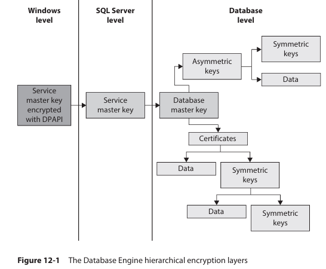

# Overview

The following begins with an overview of most important security concepts

- Data Encryption
- Authentication
- Authorization
- Schemas
- Roles
- Change Tracking
- Data Security and Views

***Some terms***

- **principal**
  - Subjects that have permission to access a particular entity.
  - A role is collection of logins and other roles.

- **Securable**

  - resources to which DB authorization system regulates access.
  - Most securable build a hierarchy.

- **Permissions**
  - securable has associated *permission* can be granted to a principal.
  
## Encrypting Data

The DB Engine secures data with hierarchical encryption layers and a key management infrastructure.
Each layer secures layer beneath it, using a combination of certificates,asymmetric keys, and symmetric keys.



**Service master key**
The service master key specifies the key that rules all other keys and certificates. the service master key is created automatically when you install the DB Engine.

- is encrypted using Windows Data  Protection API (DPAPI).
- managed by system

**DB master key**
root encryption object for all keys, certificates, and data at DB level.

- Each DB has single DB master key created by using `CREATE MASTER KEY`
- as this key is protected by service master key, it is possible for the system to automatically decrypt master key.

There are 3 types of user forms:

- ***Symmetric Keys***
  - sender and receiver shares a common key.
  - **Advantage**
    - can protect significant greater amount of data than any other type/
    - it is faster than using asymmetric key.
  - **disadvantage**
    - in distributed env, using this key can make it almost impossible to keep encryption secure.

- Each symmetric key must be opened before you can use it to encrypt data or protect another new key.

- After you open a symmetric key, you need to `EncryptByKey` system function for encryption. this function has two input parameters:
  - ID of the symmetric key to be used
  - text to be encrypted.
- for decryption, use `DecryptByKey`

- ***Asymmetric Keys***
  - consist og two parts: a private key and the corresponding public key.
  - Each key can decrypt data encrypted by the other key.
  - `EncryptByAsymKey` to encrypt data
  - `DecryptByAsymKey` to decrypt data.

- ***Certificates***
  - is a digitally signed statement that binds a value of public key to identity of the person, device or service that holds the corresponding private key.
  - Certificate are issued and signed by a certification authority (CA)
  > there is no significant difference between certificates and asymmetric keys. Both uses RSA algorithm
  - certificates contains more information
    - The subject's public key value
    - the subjects's identifier information
    - Issuer identifier information
    - The digital signature of the issuer.
- A primary benefit it relieve hosts of the need to maintain a set of passwords for individual subjects.

> Certificates provide highest level of encryption in DB engine security model. the encryption algorithm are very processor-intensive.

```SQL
USE master;
CREATE MASTER KEY
ENCRYPTION BY PASSWORD ='pls4w9dl' -- you password

GO 
CREATE CERTIFICATE cert01
    WITH SUBJECT = 'CERTIFICATE FOR DBO';

-- ENCRYPTION BY , you have to create DB master key 
-- if this option is not used CERTIFICATE is protected by DB master key 
-- 
```

## Editing Metadata Concerning User Keys

- sys.symmetric_keys
- sys.asymmetric_keys
- sys.certificates
- sys.database_principals
  - provides information about each of principals in the current information concerning existing certificates.
  
## Extensive Key management

- It is also known as EKM
  - Enhanced key security through a choice of encryption provider.
  - General key management across your enterprise
- EKM allows third party vendors to register their devices in the DB Engine.
- EKM also allows data protection form DB administrators (except members of the **sysadmin** group)
- Data can be encrypted and decrypted using T-SQL cryptographic Statements.
- DB Engine uses the external EKM as the key store.

## Methods of Data Encryption

### Transparent Data Encryption

- TDE option that encrypts the DB files automatically, without needing to alter any applications.
- prevent access by unauthorized persons even if they obtain DB files or Db backup files.
- performed at the page level
- based on a encryption key, symmetric key, which secures encrypted DB.

Steps

1. Create a DB master key
2. create a certificate
3. Create a Encryption key
4. Configure DB to use encryption

```SQL
-- associate the certificate to sample DB
CREATE DATABASE ENCRYPTION KEY 
WITH ALGORITHM = AES_128
ENCRYPTION BY SERVER CERTIFICATE cert_01;

-- Encrypt the DB 
ALTER DATABASE sample SET ENCRYPTION ON;

-- sys.dm_database_encryption_keys, which can be used to display all databases that are encrypted.
--
SELECT * FROM sys.dm_database_encryption_keys WHERE encryption_state =3;
```

### Always Encrypted

- encrypt particular columns of a Database.

> columns belonging to primary keys, and other non-sensitive columns should not be encrypted for performance reasons.

- Database driver handles the process of encrypting and decrypting of data.
- When query is executed it looks up the master key. the master key is then used to decrypt a column specific key. which in turn used for encrypting and decrypting fields and parameters.

STEPS

1. Create a column master key (CMK)
2. create a column encryption key (CEK)
3. Create a table with one or more encrypted columns.

- The column master key is used to protect column encryption key. the column master key definition object is created in DB. This object will store the information about the location of column master key.
- The easiest option for developing new application using Always Encryption is to use a certificate.

> can create a column master key using the `CREATE COLUMN MASTER KEY`statement.  create a column encryption key using the `CREATE COLUMN ENCRYPTION KEY` statement.

```SQL
CREATE TABLE employee_encr(
  emp_no INT NOT NULL,
  emp_lname nvarchar(11) COLLATE Latin1_General_BIN2 ENCRYPTED 
    WITH (ENCRYPTION_TYPE = DETERMINISTIC, ALGORITHM='AEAD_AES_256_CBC_HMAC_SHA_256',
    COLUMN_ENCRYPTION_KEY = MyCEK) NOT NULL,
    salary MONEY ENCRYPTED WITH (ENCRYPTION_TYPE=RANDOMIZED,
      ALGORITHM='AEAD_AES_256_CBC_HMAC_SHA_256', COLUMN_ENCRYPTION_KEY = MyCEK) NOT NULL
);
```

*Deterministic encryption* ensures a given value always has the same encrypted representation. can be used to seek values, join, equality comparisons, and grouping operations.

*randomized encryption* delivers a different value every time. it is more secure, because value cannot be guessed. the disadvantage is that you can not perform any operation on columns with randomized encryption.

***Always Encrypted has several general limitations***

- Alphanumeric columns are encrypted with deterministic encryption have to use the Latin1_General_BIN2 collation
- indices and constraints can be created only for columns with deterministic encryption.
- all range-like operations are disallowed.
- Client libraries need to be updated to support encryption and decryption of columns. Not all drivers will support this functionality
- The following data types are not supported : SQL_VARIANT, XML, GEOGRAPHY, GEOMETRY, and user-defined types (UDTs).

### transparent Data encryption vs Always Encrypted

- TDE is DB level. Always encrypted is column level encryption.
- With TDE, each data page is encrypted when written on disk and is decrypted when read from disk (Encrypted at rest). Always encrypted at rest and in memory, meaning data is encrypted on the disk, in memory as well. decryption is possible in user application.

#### Monitoring Always Encrypted

**sys.columns_encryption_keys** is the most important catalog  view in relation to Always encrypted. the view returns information about the column encryption keys.

```SQL
SELECT t.name as table_name, c.name as column_name, c.encryption_type_desc as encr, k.name FROM sys.columns c 
JOIN sys.column_encryption_keys k 
ON (c.column_encryption_key_id = k.column_encryption_key_id)
JOIN sys.tables t ON (c.object_id = t.object_id);
```
