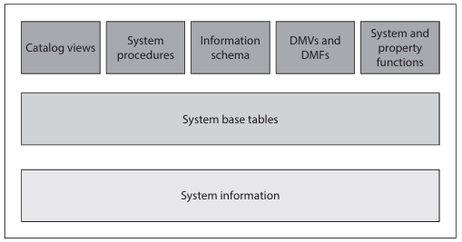

# The SYSTEM CATALOG

system catalog consists of tables describing the structure of objects such as databases, base tables, view, and indices.

- these table are called *system base table*
- System tables of **master** DB belong to the system catalog, while system tables of a particular DB form the DB catalog.
- system base tables occur only once in the entire system (if they belong exclusively to **master** DB), while others occur once in DB, including **master** DB.

> The system base tables cannot be accessed directly: you have to use existing interfaces to query the information from the system catalog.

- **CATALOG Views**
  - present the primary interface to the metadata stored in system base tables
  - Metadata describes the attributes of objects in DB system.

- **Dynamic Management view (DVMs) and functions (DMFs)**
  - observe active processes and contents of the memory

- **information schema**
  - standardized solution for the access of metadata that gives you a General interface not only for DB ENgine, but for all existing relational DB systems.

- **System and property functions**
  - allow to retrieve system information
  - difference between these two function type mainly their structure.
  - property function can return more information than system functions.

- **system SP**
  - some stored procedure (SP) can be used to access and modify the content of system base tables.



> these interface can be grouped as two : *general* (catalog views, DMVs and DMFs, and information schema) and *proprietary* interface in relation to DB Engine (system SP and property function)
> “General” means that all relational database systems support such interfaces, but use different terminology.

## General Interfaces

### Catalog Views

- most general interface to the metadata and provide the most efficient way to obtain customized forms of this information
- belongs to sys schema

#### sys.objects

- contains a row for each user-defined object in relation to the user’s
schema
- sys.system_objects a row for each system object,and sys.all_objects  union of all schema-scoped user-defined objects and system objects.

| column Name | Description|
|---| --- |
|name | the object name |
|object_id| object identification number, within the DB |
|Schema_id | ID of the schema in which object is contained|
|type| object type, which be a table, view or any other DB object that is supported through DB engine|

#### sys.columns

- contains a row for each column of an object that has columns, such as tables and views.

| column Name | Description|
|---| --- |
|object_id | ID of the object to which this column belongs |
|name| column name |
|column_id | ID of the column (unique within teh object)|

#### sys.database_principals

- contains a row for each security principal

| column Name | Description|
|---| --- |
|name | name of principal |
|principal_id| ID of the principal (unique within DB) |
|type | principal type|

```SQL
SELECT object_id, principal_id, type 
     FROM sys.objects 
     WHERE name = 'employee';
--  U in the type column stands for the user (table)
-- NULL value in the principal_id column indicates that the object’s owner is the same as the owner of the schema


-- of all tables of the sample database that contain the project_no column

SELECT sys.objects.name 
  FROM sys.objects INNER JOIN sys.columns 
  ON sys.objects.object_id = sys.columns.object_id 
   WHERE sys.objects.type = 'U' 
   AND sys.columns.name = 'project_no';

-- owner of the employee table
SELECT sys.database_principals.name 
FROM sys.database_principals INNER JOIN sys.objects 
ON sys.database_principals.principal_id = sys.objects.schema_id 
WHERE sys.objects.name = 'employee' 
AND sys.objects.type = 'U';
```

### Dynamic Management Views and Functions

return server state information that can be used to observe active processes and therefore to tune system performance or to monitor the actual system state.
